# Flash Card Memory Game

## Project Description

> My project is called Flash Card Memory Game. It's a little game to test your memory on a given topic. You will have a card displayed with a question that you must answer via the radio options. Your score will be kept so you can see how many cards you have gotten correct. If you can get every single question correct, a congratulatory message will display at the end. If you cannot get every answer correct, a "Better luck next time"-esque message will display at the end and you will have the option to restart if you so please.

> Play along and see if you can get all of the questions correct! Good luck!

## Planning Process

### User Stories

#### MVP

- As a player, I want a description of the game, so that I know what to do during play.
- As a player, I want to be able to see both the front of the card and the back, so that I know if I am getting the answer correct.
- As a player, I want a "Restart" button, so I can restart the game at any point.
- As a player, I want a scoreboard, so that I can keep track of my points.
- As a player, I want to see what the correct choice is, so I can compare and learn more.

### Wireframes

> Wireframe of game (drawn out in a notebook)

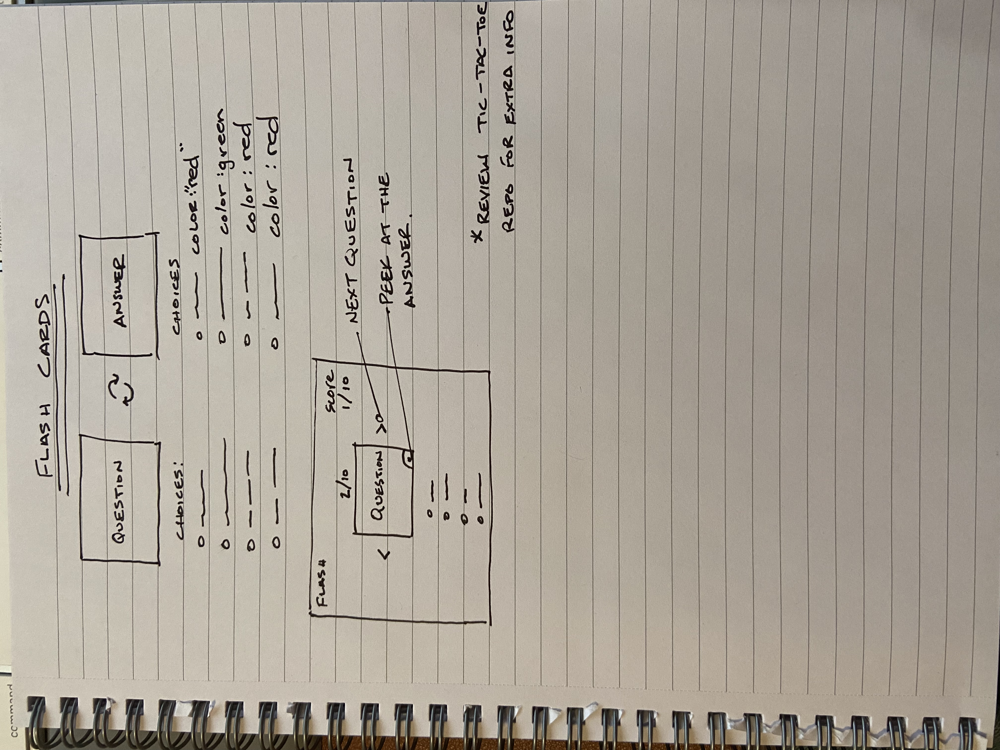

> Start the game

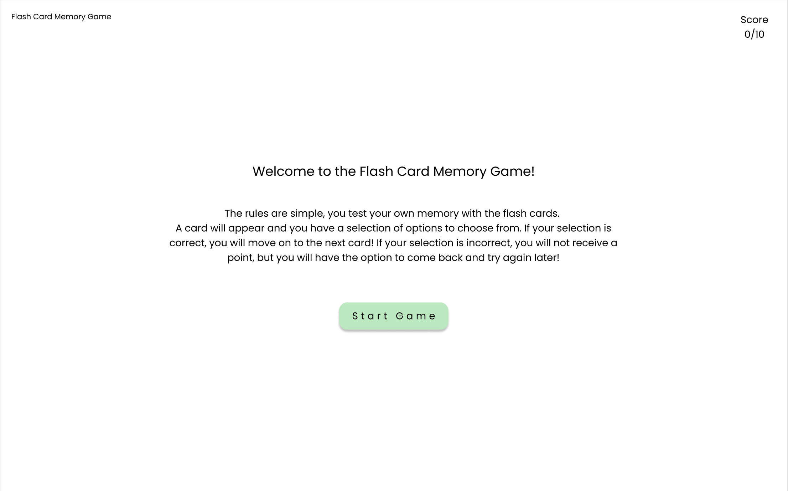

> Gameplay example

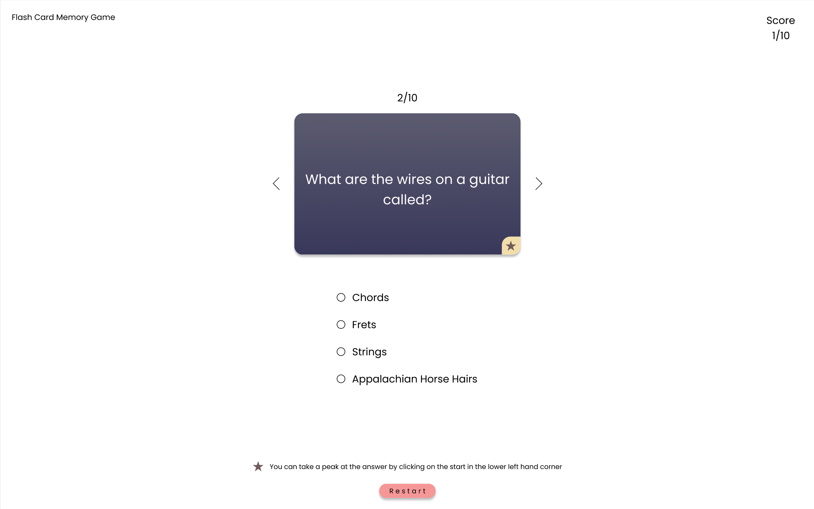

> Gameplay - Correct Answer

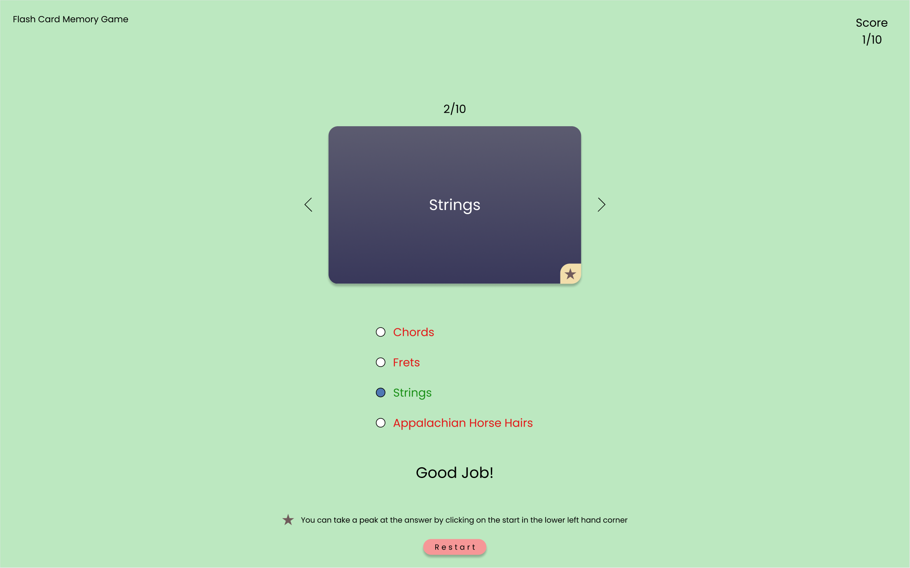

> Gameplay - Incorrect Answer

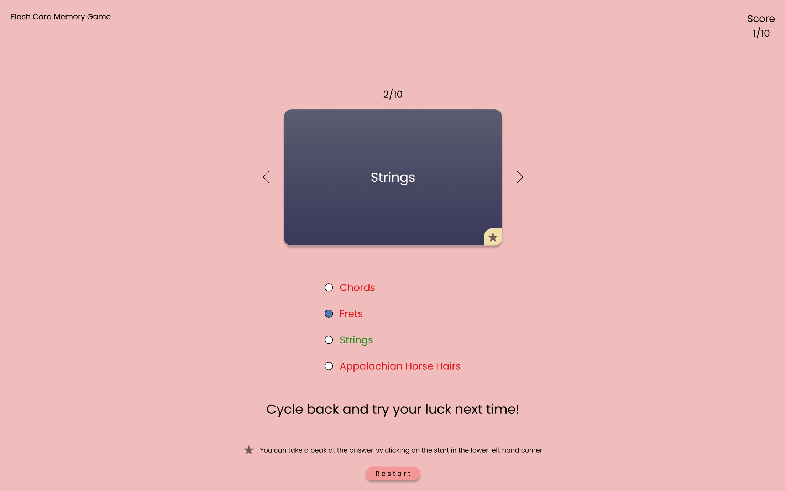

> Game End - Win

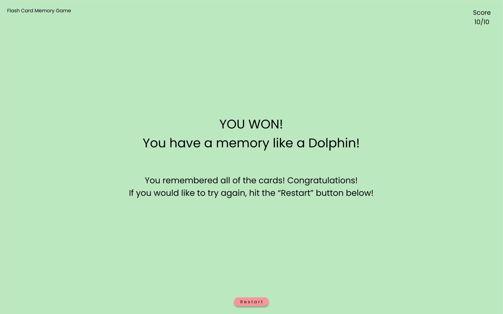

> Game End - Lose

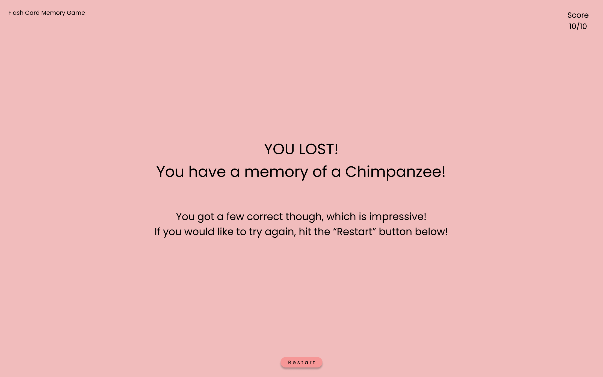

#### Bronze

- As a player, I want to see which card I am currently on, and the total amount of cards to go through.
- As a player, I want to be see animations when I flip the card over for the answer.
- As a player, I want to the background color and the text color to change, indicating if I got the answer correct.

> Example of a card with cycle buttons on the left and right side, and a counter above the card indicating the card number witin the "stack".

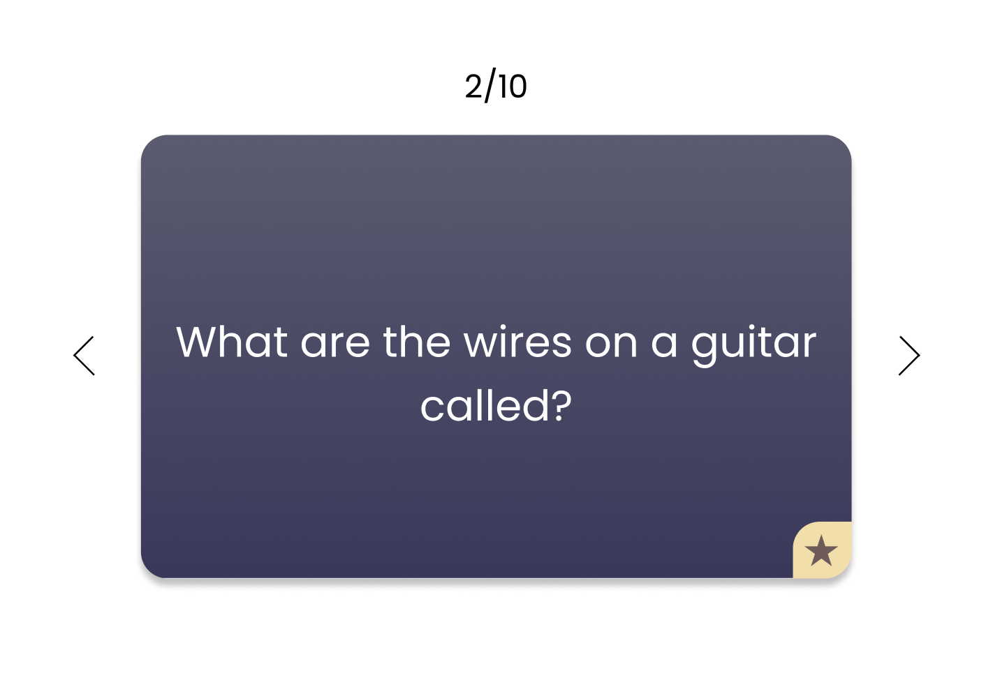

#### Silver

- As a player, I want to be able to cycle through each card without answering.
- As a player, I want to be able to preview the answer before selecting my answer.

#### Gold

- As a player, I want to have a dark theme, so I can play at night and have the light be less harsh on my eyes.
- As a player, I would like the dark theme to have a toggle so I can switch back and forth at my leisure.

> Example of a Dark Theme toggle switch

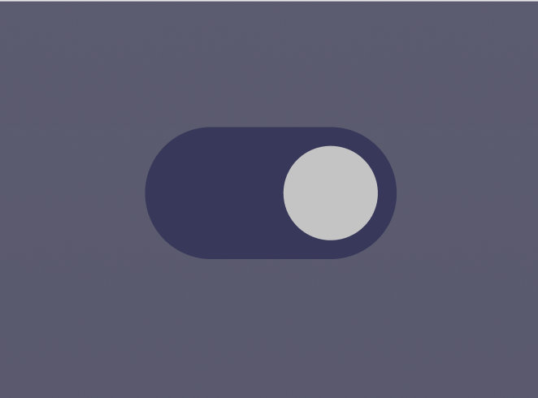

> Example of a Dark Theme during regular game play

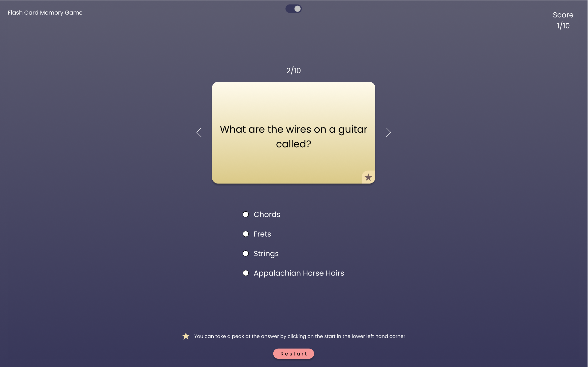

> Example of a Dark Theme when you win the game

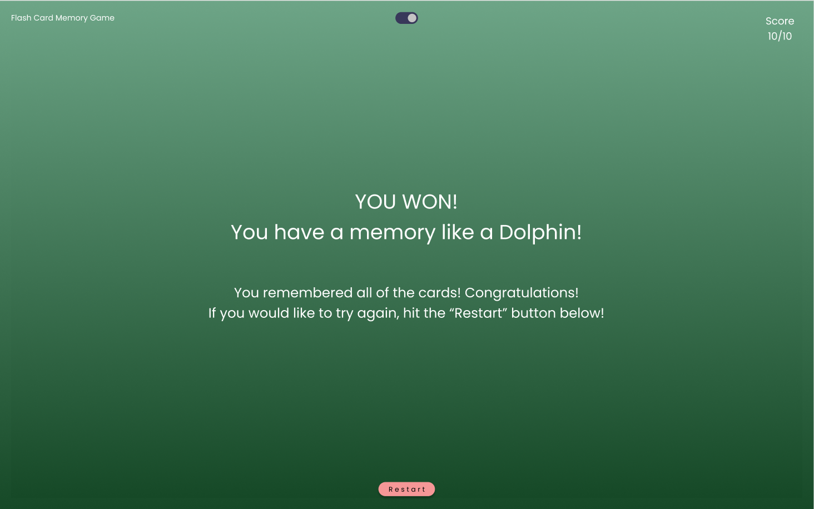

> Example of a Dark Theme when you lose the game

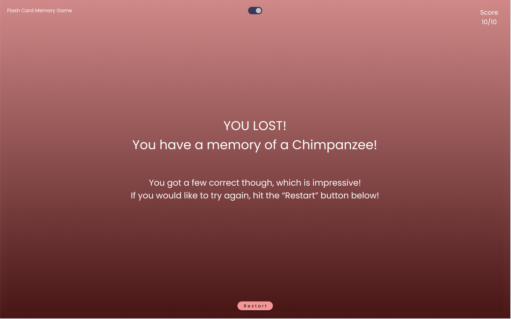
