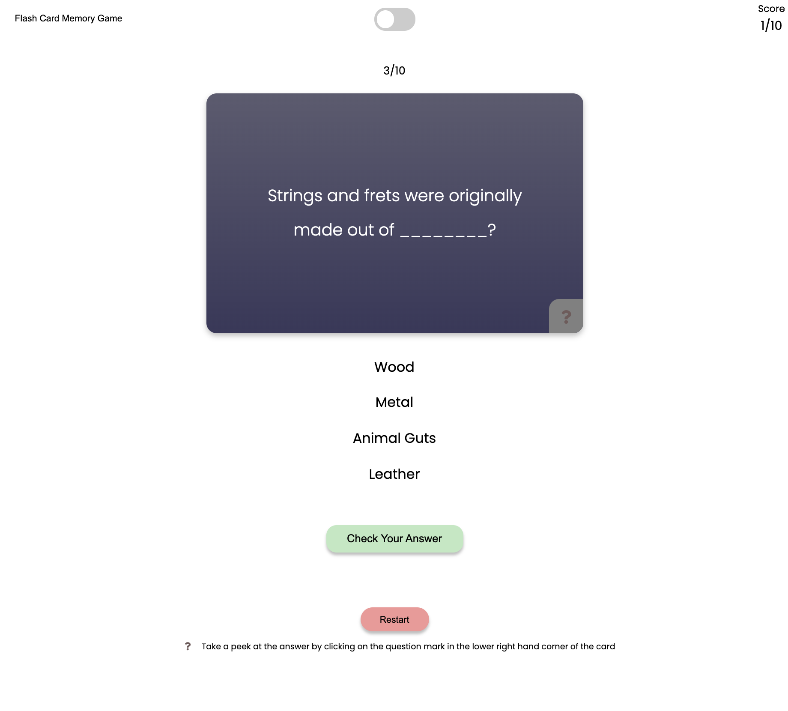
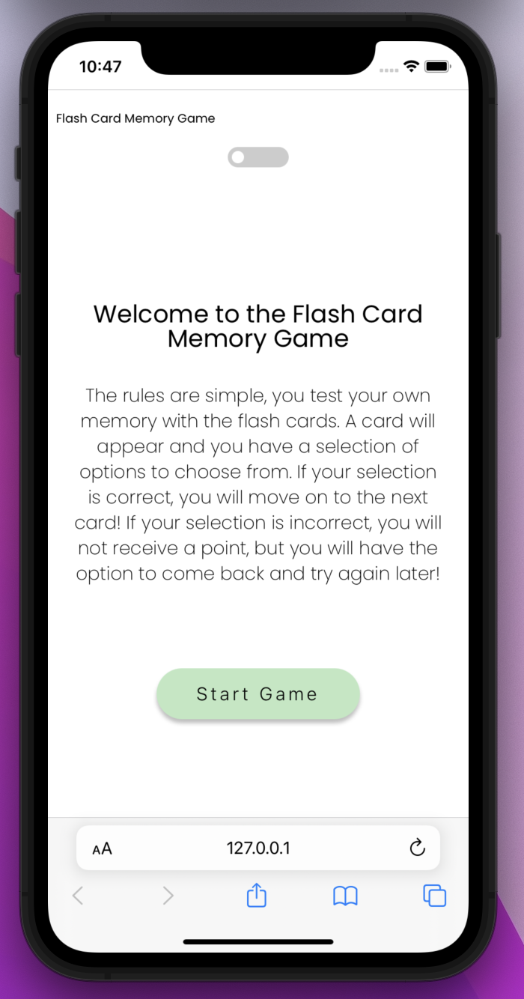

# Flash Card Memory Game

## Project Description

My project is called Flash Card Memory Game. It's a little game to test your memory on a given topic. You will have a card displayed with a question that you must answer via the radio options. Your score will be kept so you can see how many cards you have gotten correct. If you can get every single question correct, a congratulatory message will display at the end. If you cannot get every answer correct, a "Better luck next time"-esque message will display at the end and you will have the option to restart if you so please.

Play along and see if you can get all of the questions correct! Good luck!

> Screenshot of active gameplay



> Optimized for mobile play



## Technologies Used

- HTML
- CSS, flexbox, css:selectors
- JavaScript

## Installation Instructions

To install this repository:

- If you would like to fork the repository so you have your own copy, feel free to!
- Click on the green "Code" button.
- Copy either the HTTPS or SSH link that is provided
- Open up the Terminal and navigate to the desired file location
- Once inside, use the code `git clone copied_link`
- Once the repo has been installed, change into the directory with `cd flash-cards`
- From here you can run `code .` to open it up in VS Code

## Planning Process

### User Stories

#### MVP

- As a player, I want a description of the game, so that I know what to do during play.
- As a player, I want to be able to see both the front of the card and the back, so that I know if I am getting the answer correct.
- As a player, I want a "Restart" button, so I can restart the game at any point.
- As a player, I want a scoreboard, so that I can keep track of my points.
- As a player, I want to see what the correct choice is, so I can compare and learn more.

### Wireframes

> Wireframe of game (drawn out in a notebook)


> Start the game


> Gameplay example


> Gameplay - Correct Answer


> Gameplay - Incorrect Answer


> Game End - Win


> Game End - Lose


#### Bronze

- As a player, I want to see which card I am currently on, and the total amount of cards to go through.
- As a player, I want to be see animations when I flip the card over for the answer.
- As a player, I want to the background color and the text color to change, indicating if I got the answer correct.

> Example of a card with cycle buttons on the left and right side, and a counter above the card indicating the card number witin the "stack".


#### Silver

- As a player, I want to be able to cycle through each card without answering.
- As a player, I want to be able to preview the answer before selecting my answer.

#### Gold

- As a player, I want to have a dark theme, so I can play at night and have the light be less harsh on my eyes.
- As a player, I would like the dark theme to have a toggle so I can switch back and forth at my leisure.

> Example of a Dark Theme toggle switch


> Example of a Dark Theme during regular game play


> Example of a Dark Theme when you win the game


> Example of a Dark Theme when you lose the game


## Major Hurdles / Unsolved Problems

> The big thing that took a while to complete was figuring out the game win/lose logic. At first I wanted to compare the `scoreCount.innerText` to the length of the `QUESTIONS` array, but that was not giving me the necessary output. I managed to overcome that by using:

```
if (scoreCount.innerText === `10/10`) {
    winningPage();
} else if (scoreCount.innerText !== `10/10` && cardCounter.innerText === `10/10`) {
    losingPage();
}
```

> The dark theme switch has also proven to be a challenge. Currently it works, but I plan to squash the bugs in a later update. Right now, the switch changes the HTML link to a `./css/dark.css`, but the logic within `./script.js` has a few problems with implementing the switch. Primarily when a question has been answered, but the "Next Question" arrow has NOT been pressed, and the user would like to switch themes, the result is the background not switching from light to dark on "correct" or "incorrect" answer pages.
> I plan to fix the theme switch problem by implementing an object in `script.js` that will hold all of the necessary colors and will be accessible during the switch.
